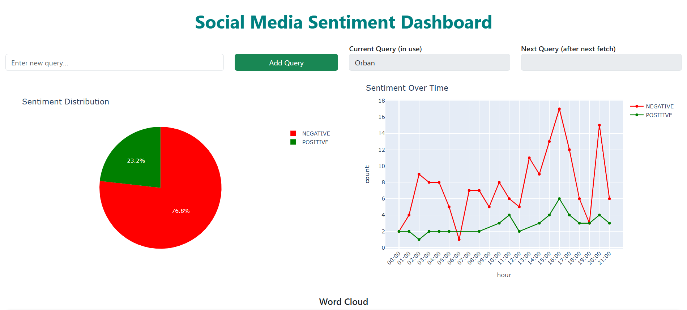
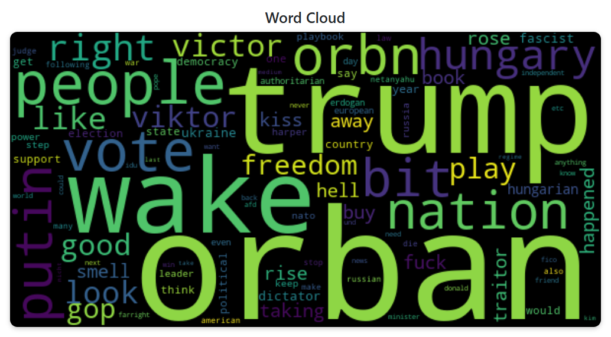
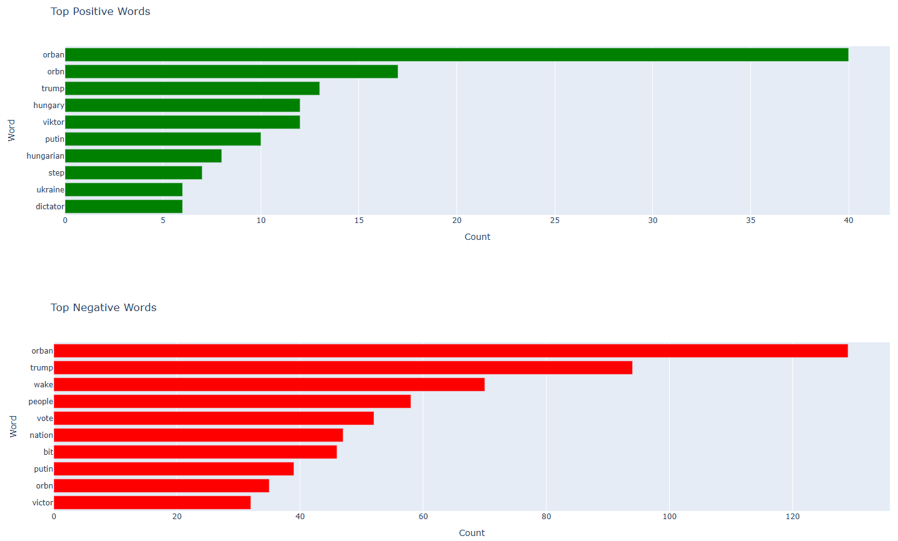
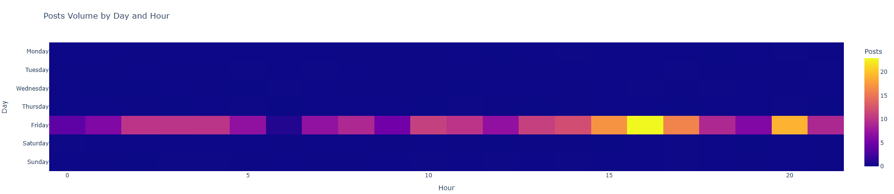

# Social Media Sentiment Analysis Dashboard

This project is a **Social Media Sentiment Analysis Dashboard** that fetches posts from the BlueSky platform, analyzes their sentiment, and visualizes the results using an interactive dashboard built with Dash and Plotly.

The application is currently deployed on Render and accessible at [https://social-media-sentiment-analysis-mpb9.onrender.com/](https://social-media-sentiment-analysis-mpb9.onrender.com/).

---

## Live Demo

The application is currently **deployed and accessible on Render**:  
[https://social-media-sentiment-analysis-mpb9.onrender.com/](https://social-media-sentiment-analysis-mpb9.onrender.com/)

---

## Screenshots









---

## Features

- **Sentiment Analysis**  
  Uses a pre-trained Hugging Face model to classify posts as positive or negative.

- **Data Visualization**  
  - Sentiment distribution pie chart  
  - Sentiment trends over time  
  - Word cloud of frequently used words  
  - Heatmap of post activity by day and hour  
  - Top positive and negative words bar charts

- **Dynamic Query Management**  
  Add and manage queries for fetching posts.

- **Translation Support**  
  Automatically translates non-English posts to English using Google Translate.

- **Data Cleaning**  
  Cleans and preprocesses text data for analysis.

---

## Prerequisites

- **Python**: 3.9 or later  
- **Database**: PostgreSQL (or any database supported by SQLAlchemy)  
- **BlueSky account**: Credentials for fetching posts  

---

## Setup Instructions

### 1. Clone the Repository

```bash
git clone https://github.com/retroruiner/Social-Media-Sentiment-Analysis.git
cd Social-Media-Sentiment-Analysis
```

### 2. Set Up a Virtual Environment

```bash
python -m venv venv
source venv/bin/activate    # On Windows: venv\Scripts\activate
```

### 3. Install Dependencies

```bash
pip install -r requirements.txt
```

### 4. Configure Environment Variables

Create a `.env` file in the root directory with the following variables:

```dotenv
DATABASE_URL=postgresql://<username>:<password>@<host>:<port>/<database>
BLUESKY_USERNAME=<your_bluesky_username>
BLUESKY_PASSWORD=<your_bluesky_password>
DEFAULT_QUERY=Kyrgyzstan
```

### 5. Initialize the Database

Run the following script to create the necessary database tables:

```bash
python create_tables.py
```

### 6. Run the Application Locally

Start the Flask and Dash application:

```bash
python app.py
```

The dashboard will be accessible at [http://127.0.0.1:8050](http://127.0.0.1:8050).

---

## Project Structure

```
Social-Media-Sentiment-Analysis/
├── src/
│   ├── app.py                   # Main Dash application
│   ├── bluesky_manager.py       # Handles fetching posts from the BlueSky API
│   ├── data_processor.py        # Processes posts for visualization
│   ├── sentiment_analyzer.py    # Sentiment analysis logic
│   ├── models/                  # SQLAlchemy models
│   │   └── post.py              # Post model definition
│   ├── utils/                   # Utility modules (e.g., text cleaning, translation)
│   │   ├── text_cleaner.py
│   │   └── translate_posts.py
│   └── db/                      # Database connection setup
├── fetch_and_store.py           # Script to fetch and store posts
├── create_tables.py             # Script to initialize database tables
├── requirements.txt             # Python dependencies
├── .github/workflows/           # GitHub Actions CI/CD pipeline
│   └── run-pipeline.yml
└── README.md                    # Project overview
```

---

## Key Components

1. **Data Fetching**  
   - `src/bluesky_manager.py`: Handles fetching posts from the BlueSky API.  
   - `fetch_and_store.py`: Fetches posts, cleans text, analyzes sentiment, and stores results in the database.

2. **Data Processing**  
   - `src/data_processor.py`: Processes posts for visualization (e.g., word frequency, sentiment trends).  
   - `src/utils/text_cleaner.py`: Cleans and preprocesses text data.  
   - `src/utils/translate_posts.py`: Translates non-English posts to English.

3. **Visualization**  
   - `src/app.py`: Dash application for visualizing sentiment analysis results.

4. **Sentiment Analysis**  
   - `src/sentiment_analyzer.py`: Uses Hugging Face’s `distilbert-base-uncased-finetuned-sst-2-english` model for sentiment classification.

---

## CI/CD Pipeline

The project includes a GitHub Actions workflow (`.github/workflows/run-pipeline.yml`) to automate the sentiment analysis pipeline. It:

1. Installs dependencies  
2. Runs the `fetch_and_store.py` script to fetch and analyze posts

---

## How It Works

1. **Fetch Posts**  
   Posts are fetched from the BlueSky API based on the current query.

2. **Clean and Translate**  
   Text is cleaned and translated to English if necessary.

3. **Analyze Sentiment**  
   Sentiment is analyzed using a pre-trained model.

4. **Store Results**  
   Results are stored in a PostgreSQL database.

5. **Visualize Data**  
   The Dash app visualizes the data with interactive charts and graphs.

---

## Future Improvements

- Add support for more social media platforms  
- Enhance the sentiment analysis model with fine-tuning  
- Improve the dashboard UI/UX  
- Add more advanced visualizations (e.g., network graphs)

---

## Acknowledgments

- **Dash** for building the interactive dashboard  
- **Hugging Face Transformers** for sentiment analysis  
- **Google Translate API** for translation  
- **SQLAlchemy** for database ORM